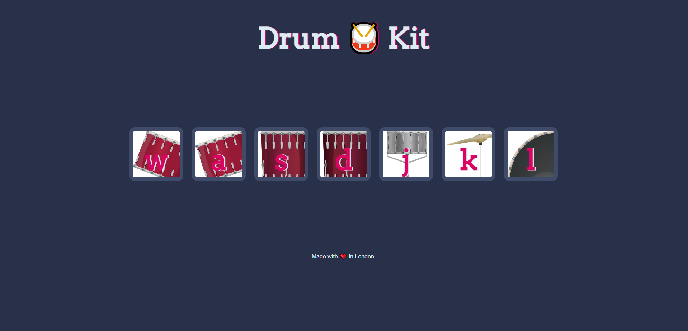

# DrumKit

This is a exercices for [The Complete 2023 Web Development Bootcamp](https://www.udemy.com/course/the-complete-web-development-bootcamp/).

With a simple virtual drum kit built with HTML, CSS, and JavaScript. You can play different drum sounds by clicking on the drum images or pressing the corresponding keys on your keyboard.

## Demo

You can see a live demonstration of the DrumKit here: [DrumKit Demo](https://jaimedargallo.github.io/DrumKit/)

## Features

- Simple and user-friendly user interface.
- Realistic drum sounds.
- Response to click and keyboard events.
- Fun for kids.

## Usage

1. Open the [live demo](https://jaimedargallo.github.io/DrumKit/).

2. Click on the drums with your mouse or press the corresponding keys on your keyboard to play the drum sounds.

3. Have fun creating your own melodies!

## Acknowledgments

I would like to take this opportunity to express my heartfelt gratitude and appreciation to the instructor of this Bootcamp: [Dr. Angela Yu]([https://github.com/boton](https://www.udemy.com/course/the-complete-web-development-bootcamp/#instructor-1)).
A great profesional and better person.

